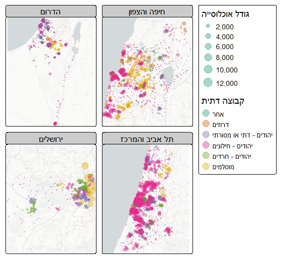
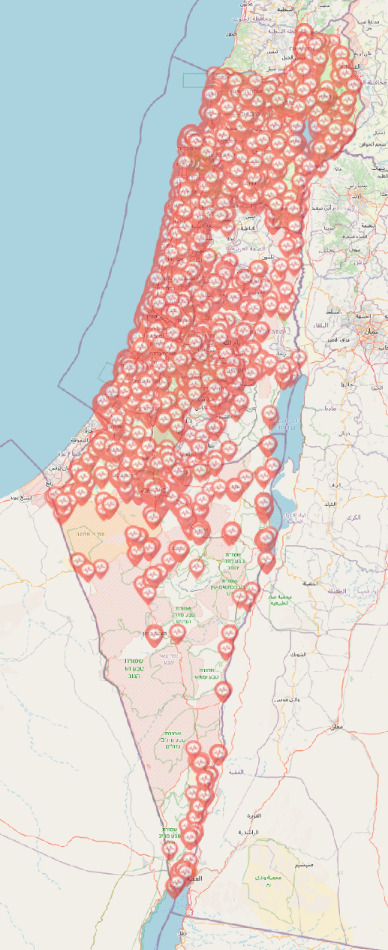
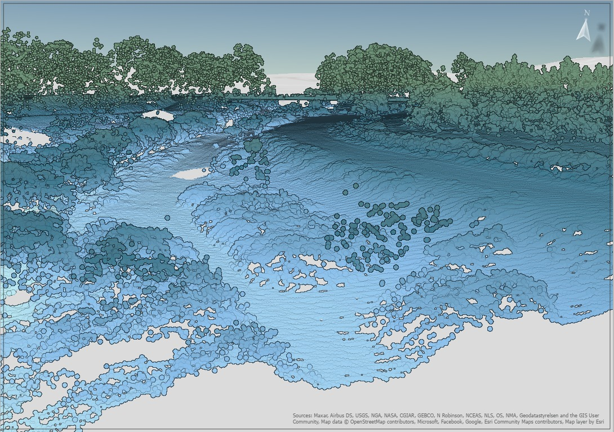

# יום 1: נקודות | Day 1: Points

## נושא | Theme
צרו מפה עם נתוני נקודות - מיקומים, צבירות, נקודות עניין

Create a map with point data - locations, clusters, POIs

## רעיונות | Ideas
- מפת נקודות עניין בעיר שלכם
- צפיפות אוכלוסין עם נקודות
- מיקומי חנויות או שירותים
- נקודות מדידה או תצפית

---

- Map of points of interest in your city
- Population density with points
- Store or service locations
- Measurement or observation points

## תוצאות | Results
הוסיפו את המפה שלכם לתיקיית `images/`!  
Add your map to the `images/` folder!

### עדו קליין

[קישור](https://x.com/idoklein1/status/1984695427359240486)  
### איתן וייס שיינברג

[קישור](https://x.com/EithanSchon/status/1984727770799489477)  
### רועי קנת פורטל
  
### אליאב שטול-טראורינג
  
### שלי אלבז

### ויטלי אויסאטינסקי

