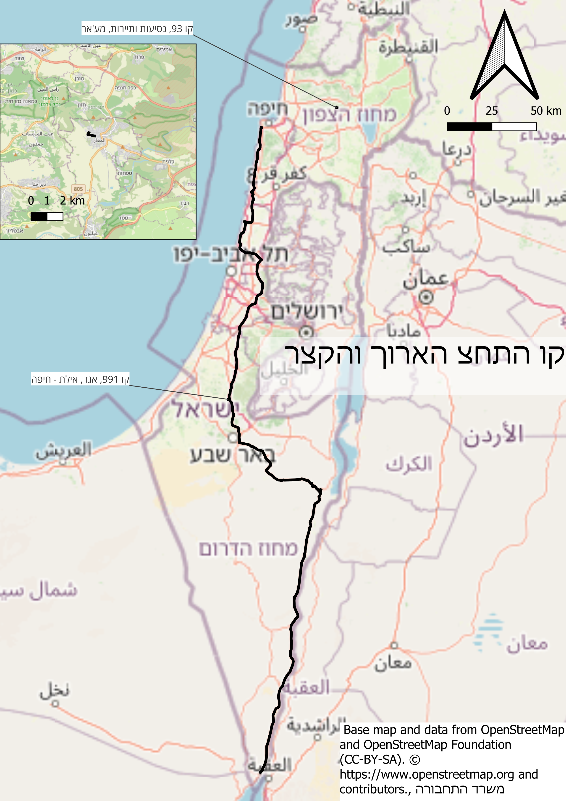
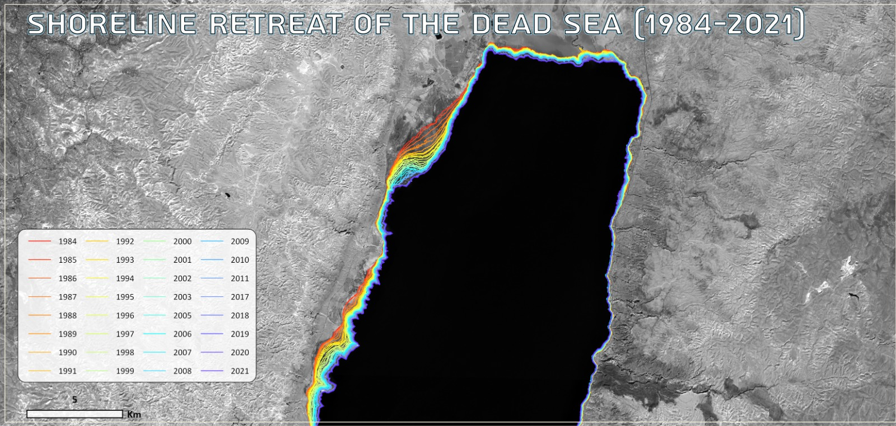
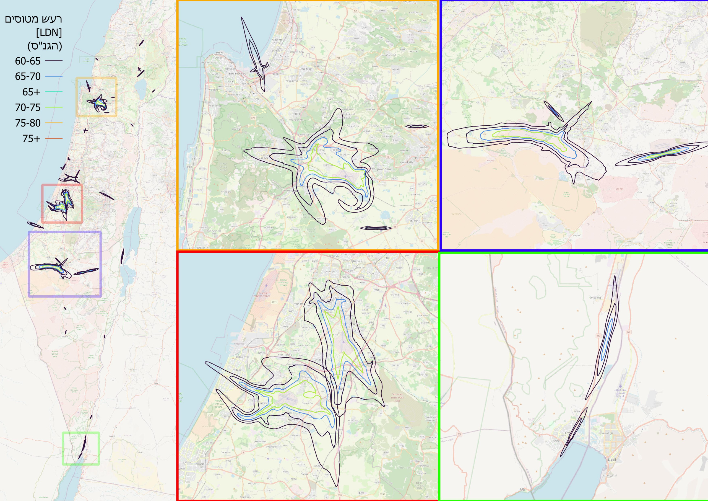
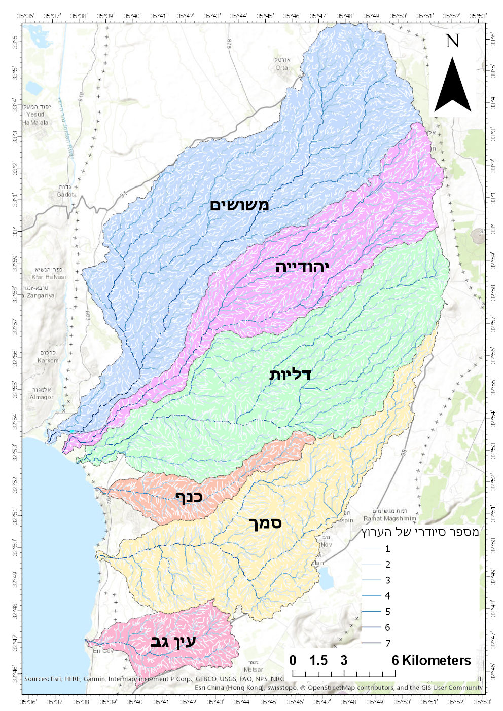
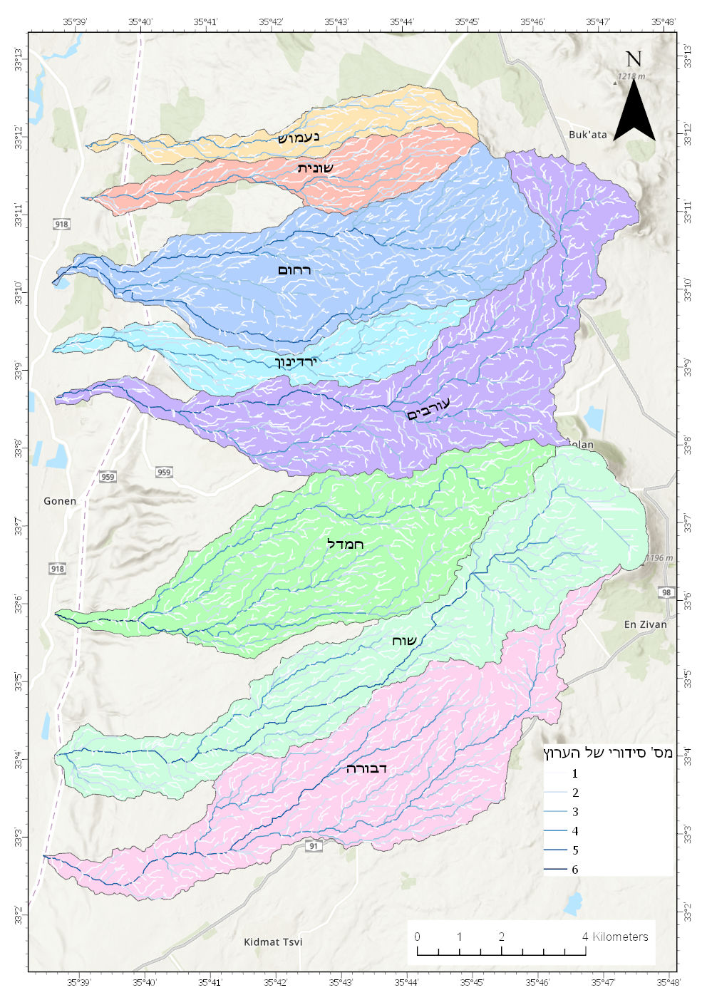
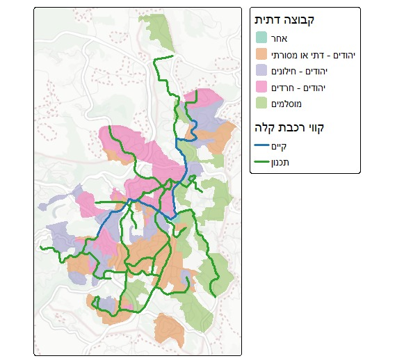

# יום 2: קווים | Day 2: Lines

## נושא | Theme
מפו מאפיינים ליניאריים כמו כבישים, נהרות או קווי זרימה

Map linear features like roads, rivers, or flow lines

## רעיונות | Ideas
- מפת רשת כבישים
- מערכות נהרות
- קווי זרימה ותנועה
- נתיבי תחבורה ציבורית

---

- Road network map
- River systems
- Flow and movement lines
- Public transit routes

## תוצאות | Results
הוסיפו את המפה שלכם לתיקיית `images/`!

Add your map to the `images/` folder!

### איתן וייס שינברג

[קישור](https://x.com/EithanSchon/status/1985015997087072397)
### עדו קליין

[קישור](https://x.com/idoklein1/status/1985052678750105670)
### שלי אלבז

### אליאב שטול-טראורינג
  
### אורי אוברמן
[קישור](https://x.com/ori_oberman/status/1985047412730143008)
### ויטלי אויסאטינסקי
  
  
### רועי קנת פורטל
  