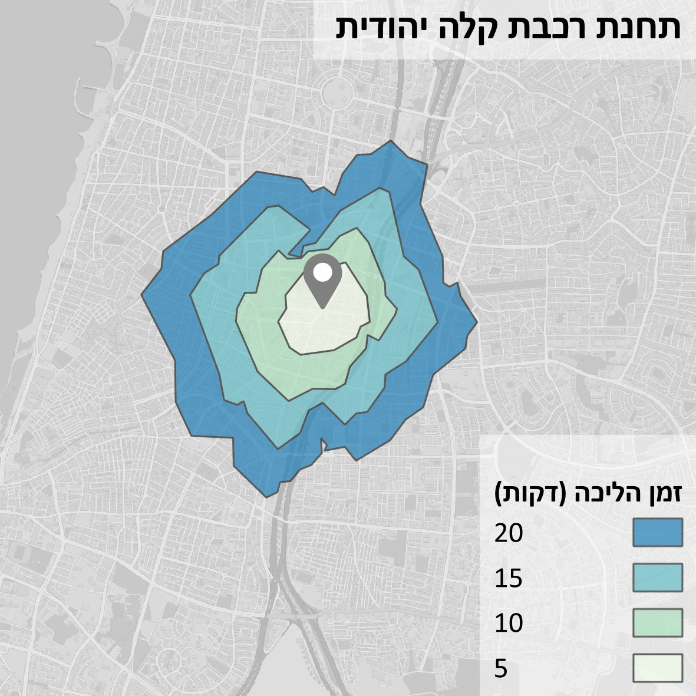
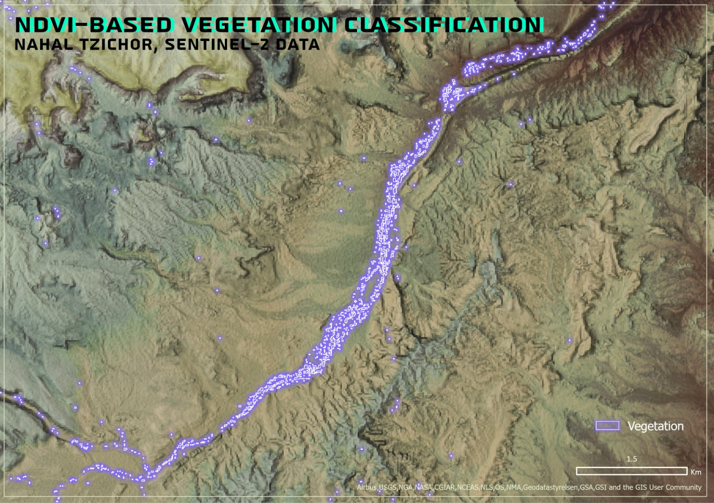
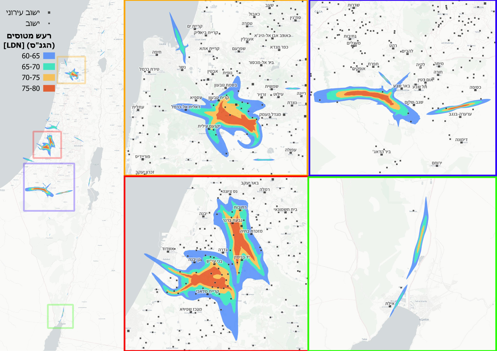

# יום 3: פוליגונים | Day 3: Polygons

## נושא | Theme
מאפייני שטח - גבולות, שימושי קרקע, מילוי ודפוסים

Area features - boundaries, land use, fills and patterns

## רעיונות | Ideas
- מפת שימושי קרקע
- גבולות מנהליים
- אזורי בנייה
- דפוסי צבע ומרקם

---

- Land use map
- Administrative boundaries
- Built-up areas
- Color and texture patterns

## תוצאות | Results
הוסיפו את המפה שלכם לתיקיית `images/`!

Add your map to the `images/` folder!
### איתן וייס שיינברג

[קישור](https://x.com/EithanSchon/status/1985384916608303497)
### עדו קליין

[קישור](https://x.com/idoklein1/status/1985419650717372477)
### שלי אלבז

### אליאב שטול-טראורינג
  